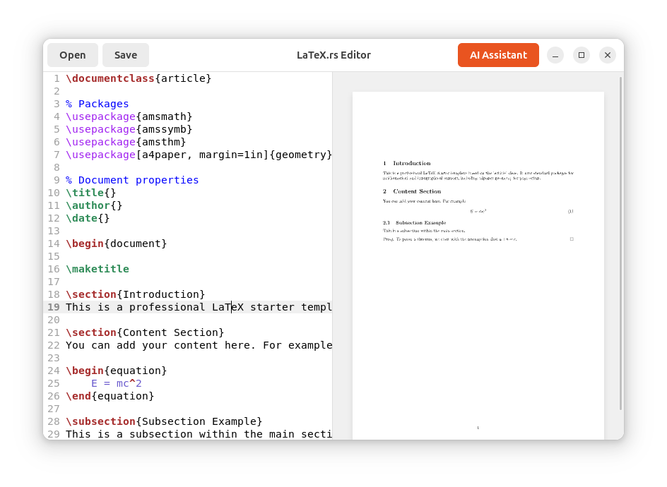

# LaTeX Editor with AI Integration

A modern, privacy-focused LaTeX editor built in Rust with GTK4, featuring real-time previews and local AI assistance via Ollama.



## Overview

LaTeX-rs has been modernized to provide a world-class scientific writing experience. Built with **Rust**, **GTK 4**, and **Libadwaita**, it follows the latest GNOME HIG (Human Interface Guidelines) to provide a seamless, beautiful, and distraction-free environment for professional researchers and students.

## Features

- **Professional UI**: Native Libadwaita interface with adaptive layouts and modern GNOME styling.
- **Real-time LaTeX Preview**: Live rendering via **pdflatex** → **SVG** pipeline displayed in **WebKit 6**.
- **Privacy-First AI**: Integrated 100% local AI assistance via **Ollama** (supports Qwen, Llama, and more).
- **Professional Editor**: Advanced syntax highlighting and editing features powered by **SourceView 5**.
- **Native Performance**: Built entirely in Rust for maximum reliability and speed.
- **Modern Standards**: Uses GTK 4, WebKit 6, and follows the latest Rust 2021 conventions.

## Build Requirements

LaTeX-rs uses the latest GTK stack. Ensure you have the following system dependencies installed:

### Ubuntu/Debian

```shell
sudo apt install libgtk-4-dev libadwaita-1-dev libgtksourceview-5-dev libwebkitgtk-6.0-dev
sudo apt install texlive-latex-base texlive-latex-extra poppler-utils
```

### Fedora

```shell
sudo dnf install gtk4-devel libadwaita-devel gtksourceview5-devel webkitgtk6.0-devel
sudo dnf install texlive-scheme-basic poppler-utils
```

### macOS (Homebrew)

```shell
brew install gtk4 libadwaita gtksourceview5 webkitgtk6
brew install --cask mactex-no-gui
brew install poppler
```

## Installation

1. **Install Ollama** (optional, for AI features):

   ```shell
   curl -fsSL https://ollama.ai/install.sh | sh
   ollama pull qwen3:0.6b  # Recommended lightweight model
   ```

2. **Clone & Run**:

   ```shell
   git clone https://github.com/AndresCdo/latex-rs.git
   cd latex-rs
   cargo run --release
   ```

## Usage

| Action | How |
|--------|-----|
| **Open file** | Click "Open" button or drag & drop |
| **Save file** | Click "Save" button |
| **Live preview** | Edit in left pane, see rendered PDF in right pane |
| **AI Assistant** | Click "AI Assistant" button, type instruction, press Enter |

## AI Capabilities

Unlock the power of local LLMs directly in your editor:

- **Auto-Correction**: Fix LaTeX syntax errors instantly
- **Scientific Assistance**: Generate complex mathematical equations from natural language
- **Document Refactoring**: Improve the structure and flow of your scientific papers
- **Equation Generation**: Describe math in plain English, get LaTeX code
- **Paper Review**: Get feedback on document structure and content

## Architecture

```
┌─────────────────────────────────────────────────────────────┐
│                     GTK 4 + Libadwaita                       │
├─────────────────────────────┬───────────────────────────────┤
│     SourceView 5 Editor     │     WebKit 6 Preview          │
│     (LaTeX highlighting)    │     (SVG rendering)           │
├─────────────────────────────┴───────────────────────────────┤
│                    Tokio Async Runtime                       │
├─────────────────────────────┬───────────────────────────────┤
│     Compilation Queue       │     Ollama AI Client          │
│     (pdflatex → pdftocairo) │     (Local LLM inference)     │
└─────────────────────────────┴───────────────────────────────┘
```

Key components:

- **UI Layer**: Programmatic GTK 4 with Libadwaita for GNOME integration
- **Async Runtime**: Tokio + GLib MainContext for non-blocking operations
- **Preview Pipeline**: pdflatex compiles LaTeX, pdftocairo converts to SVG
- **Error Handling**: Robust reporting using `anyhow` and `thiserror`
- **Logging**: Professional-grade tracing with `tracing` crate

## Contributing

Contributions welcome! Please see [CONTRIBUTING.md](CONTRIBUTING.md) for guidelines.

## License

MIT License - see [LICENSE](LICENSE) file for details.

## Acknowledgments

- [markdown-rs](https://github.com/nilgradisnik/markdown-rs) for the original editor inspiration
- [gtk-rs](https://gtk-rs.org/) for excellent Rust bindings to GTK
- [Ollama](https://ollama.ai/) for local AI inference
- [TeX Live](https://tug.org/texlive/) for the LaTeX distribution